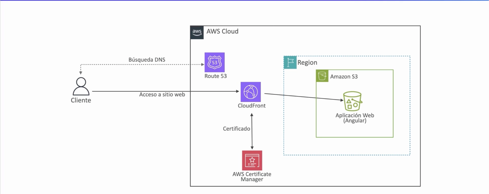

# 🚀 Bootcamp AWS — Angular + AWS

Aplicación web desarrollada con **Angular 15** como proyecto práctico para el **Bootcamp de AWS**.

El proyecto muestra diferentes formas de ejecutar y desplegar una aplicación Angular:

* 💻 Desarrollo local con Angular CLI.
* 🏗️ Generación de una build de producción.
* ☁️ Despliegue de la aplicación en **Amazon S3**.
* 🌐 Distribución mediante **Amazon CloudFront**.
* 🔐 Configuración de certificado SSL/TLS mediante **AWS Certificate Manager**.
* 🌍 Resolución del dominio mediante **Amazon Route 53**.
* 🐳 Ejecución mediante **Docker + Nginx**.

---

## 🏗️ Arquitectura AWS

La aplicación sigue una arquitectura basada en servicios administrados de AWS:

```text
                    ┌─────────────────┐
                    │     Cliente     │
                    └────────┬────────┘
                             │
                             │ Búsqueda DNS
                             ▼
                    ┌─────────────────┐
                    │   Amazon Route  │
                    │       53        │
                    └────────┬────────┘
                             │
                             │ Acceso al sitio
                             ▼
                    ┌─────────────────┐
                    │   CloudFront    │
                    └────────┬────────┘
                             │
                             │ Contenido estático
                             ▼
                    ┌─────────────────┐
                    │    Amazon S3    │
                    │                 │
                    │ Angular App     │
                    └─────────────────┘
                             
                    ┌─────────────────┐
                    │ AWS Certificate │
                    │     Manager     │
                    └─────────────────┘
                             │
                             └── Certificado SSL/TLS
```

### Flujo de acceso

1. El usuario introduce el dominio de la aplicación en el navegador.
2. **Amazon Route 53** realiza la resolución DNS.
3. La petición llega a **Amazon CloudFront**.
4. CloudFront obtiene el contenido estático desde **Amazon S3**.
5. S3 almacena los archivos generados por Angular.
6. **AWS Certificate Manager (ACM)** proporciona el certificado SSL/TLS para permitir el acceso mediante HTTPS.
7. CloudFront distribuye el contenido desde sus ubicaciones perimetrales, mejorando el rendimiento de la aplicación.

### Diagrama

El proyecto incluye el siguiente diagrama de arquitectura:


---

# 🛠️ Tecnologías utilizadas

| Tecnología              | Uso                                            |
| ----------------------- | ---------------------------------------------- |
| Angular 15              | Desarrollo de la aplicación web                |
| Angular CLI             | Gestión y construcción del proyecto            |
| Node.js                 | Entorno de ejecución                           |
| npm                     | Gestión de dependencias                        |
| Amazon S3               | Almacenamiento y hosting de archivos estáticos |
| Amazon CloudFront       | CDN y distribución de contenido                |
| Amazon Route 53         | Gestión DNS                                    |
| AWS Certificate Manager | Certificados SSL/TLS                           |
| Docker                  | Contenerización                                |
| Nginx                   | Servidor web                                   |
| Git / GitHub            | Control de versiones                           |

---

# 📋 Requisitos previos

Antes de ejecutar el proyecto, es necesario tener instalado:

* Node.js
* npm
* Angular CLI
* Git

Puedes comprobar las versiones instaladas con:

```bash
node -v
npm -v
ng version
```

> **Nota:** este proyecto fue generado originalmente con Angular CLI `15.0.0`. Se recomienda utilizar una versión de Node.js compatible con Angular 15.

---

# 💻 Instalación

Clona el repositorio:

```bash
git clone <URL_DEL_REPOSITORIO>
```

Accede al directorio del proyecto:

```bash
cd 18-WebApp-con-Angular-lineleron
```

Instala las dependencias:

```bash
npm install
```

Una vez instaladas las dependencias, puedes iniciar el servidor de desarrollo.

---

# 🚀 Servidor de desarrollo

Ejecuta:

```bash
ng serve
```

Después abre en el navegador:

```text
http://localhost:4200/
```

La aplicación se recargará automáticamente cuando se detecten cambios en los archivos fuente.

También puedes utilizar:

```bash
ng serve --open
```

para iniciar el servidor y abrir automáticamente la aplicación en el navegador.

> **Importante:** ejecuta los comandos desde la carpeta raíz del proyecto, donde se encuentra el archivo `angular.json`.

---

# 🧱 Generación de componentes

Angular CLI permite generar diferentes elementos de la aplicación.

Por ejemplo, para crear un componente:

```bash
ng generate component component-name
```

También se pueden generar:

```bash
ng generate directive nombre
ng generate pipe nombre
ng generate service nombre
ng generate class nombre
ng generate guard nombre
ng generate interface nombre
ng generate enum nombre
ng generate module nombre
```

---

# 🏗️ Build de producción

Para generar la versión optimizada de la aplicación:

```bash
ng build
```

Los archivos generados se almacenarán dentro de:

```text
dist/
```

En este proyecto, la aplicación generada se encuentra en:

```text
dist/blockstellart-bootcamp/
```

La carpeta `dist/` contiene los archivos estáticos necesarios para ejecutar la aplicación.

Entre ellos se encuentra:

```text
index.html
```

Este archivo es especialmente importante para el despliegue en S3.

---

# ☁️ Despliegue en Amazon S3

La aplicación Angular puede desplegarse en un bucket de Amazon S3.

## 1. Generar la build

Desde la raíz del proyecto:

```bash
ng build
```

Esto generará los archivos de producción dentro de:

```text
dist/blockstellart-bootcamp/
```

## 2. Crear el bucket S3

Crea un bucket en Amazon S3 destinado a almacenar los archivos de la aplicación.

Por ejemplo:

```text
blockstellart-bootcamp-website
```

## 3. Subir los archivos

Si tienes configurado AWS CLI, puedes utilizar:

```bash
aws s3 sync dist/blockstellart-bootcamp/ s3://blockstellart-bootcamp-website/
```

Este comando sincroniza el contenido de la carpeta `dist` con el bucket S3.

## 4. Comprobar los archivos

Después de realizar la sincronización, el bucket debería contener los archivos generados por Angular, incluyendo:

```text
index.html
main.*.js
polyfills.*.js
runtime.*.js
styles.*.css
assets/
```

---

# 🌐 Amazon CloudFront

Para mejorar la distribución de la aplicación se puede utilizar **Amazon CloudFront** delante del bucket S3.

La arquitectura queda:

```text
Usuario
   │
   ▼
Route 53
   │
   ▼
CloudFront
   │
   ▼
Amazon S3
   │
   ▼
Angular
```

CloudFront funciona como CDN y permite distribuir los archivos de la aplicación desde ubicaciones cercanas a los usuarios.

Entre sus ventajas:

* Menor latencia.
* Distribución global.
* Caché de archivos estáticos.
* Integración con HTTPS.
* Integración con certificados de AWS Certificate Manager.

---

# 🔐 HTTPS y AWS Certificate Manager

Para utilizar HTTPS se puede crear un certificado mediante **AWS Certificate Manager (ACM)**.

El certificado se asocia con CloudFront para permitir que los usuarios accedan a la aplicación mediante:

```text
https://tu-dominio.com
```

El flujo sería:

```text
Cliente
   │
   │ HTTPS
   ▼
CloudFront
   │
   │
   ▼
Amazon S3
```

---

# 🌍 Amazon Route 53

**Amazon Route 53** se utiliza para gestionar el DNS del dominio.

El flujo de resolución es:

```text
tu-dominio.com
       │
       ▼
   Route 53
       │
       ▼
   CloudFront
       │
       ▼
      S3
```

De esta forma, el usuario no necesita conocer directamente la dirección del bucket o de CloudFront.

---

# 🐳 Docker + Nginx

El proyecto también incluye soporte para ejecutar la aplicación Angular dentro de un contenedor Docker utilizando **Nginx** como servidor web.

La imagen utiliza una construcción multietapa (*multi-stage build*).

La primera etapa se utiliza para construir la aplicación Angular y la segunda para servir los archivos generados mediante Nginx.

Esto permite mantener una imagen final más ligera.

---

# ⚙️ Nginx

El archivo:

```text
nginx.conf
```

contiene la configuración utilizada por Nginx.

La configuración permite servir la aplicación Angular y gestionar correctamente las rutas del frontend.

Esto es especialmente importante en aplicaciones Angular que utilizan rutas como:

```text
/
 /home
 /about
 /contact
```

Cuando el usuario accede directamente a una ruta, Nginx debe devolver `index.html` para que Angular pueda gestionar el enrutamiento.

---

# 🐳 Construcción de la imagen Docker

Desde la raíz del proyecto, donde se encuentra el `Dockerfile`, ejecuta:

```bash
docker build -t blockstellart-ws .
```

Esto creará una imagen Docker llamada:

```text
blockstellart-ws
```

Puedes comprobar que la imagen existe mediante:

```bash
docker images
```

---

# ▶️ Ejecutar la aplicación con Docker

Para iniciar un contenedor:

```bash
docker run --name bootcamp-ws -dp 8080:80 blockstellart-ws
```

La aplicación estará disponible en:

```text
http://localhost:8080
```

El mapeo de puertos es:

```text
Puerto local 8080
        │
        ▼
Puerto 80 del contenedor
        │
        ▼
      Nginx
        │
        ▼
 Angular
```

---

# 🔍 Comprobar el contenedor

Puedes comprobar que el contenedor está ejecutándose con:

```bash
docker ps
```

Para consultar los logs:

```bash
docker logs bootcamp-ws
```

Para detenerlo:

```bash
docker stop bootcamp-ws
```

Para volver a iniciarlo:

```bash
docker start bootcamp-ws
```

Para eliminarlo:

```bash
docker rm bootcamp-ws
```

---

# 🧪 Pruebas unitarias

Angular utiliza Karma para ejecutar las pruebas unitarias.

Ejecuta:

```bash
ng test
```

---

# 🧪 Pruebas end-to-end

Angular permite utilizar pruebas end-to-end mediante una plataforma compatible.

El comando:

```bash
ng e2e
```

requiere que el proyecto tenga instalado un paquete que implemente las capacidades de testing end-to-end.

---

# 📁 Estructura del proyecto

Una estructura aproximada del proyecto es:

```text
18-WebApp-con-Angular-lineleron/
│
├── src/
│   ├── app/
│   ├── assets/
│   ├── environments/
│   └── index.html
│
├── docs/
│   └── arquitectura-aws.png
│
├── angular.json
├── package.json
├── package-lock.json
├── Dockerfile
├── nginx.conf
├── .dockerignore
├── README.md
└── tsconfig.json
```

---

# 🔄 Flujo completo del proyecto

El flujo de trabajo completo puede resumirse de la siguiente manera:

```text
                    DESARROLLO
                         │
                         ▼
                    Angular 15
                         │
                         ▼
                     ng build
                         │
                         ▼
                  carpeta dist/
                         │
             ┌───────────┴───────────┐
             │                       │
             ▼                       ▼
        Amazon S3                Docker
             │                       │
             ▼                       ▼
        CloudFront                  Nginx
             │                       │
             ▼                       ▼
         Route 53              localhost:8080
             │
             ▼
        Usuario final
```

---

# 📚 Recursos

* [Angular CLI](https://angular.io/cli)
* [Angular](https://angular.io/)
* [Amazon S3 — Static Website Hosting](https://docs.aws.amazon.com/es_es/AmazonS3/latest/userguide/HostingWebsiteOnS3Setup.html)
* [Amazon CloudFront](https://aws.amazon.com/cloudfront/)
* [Amazon Route 53](https://aws.amazon.com/route53/)
* [AWS Certificate Manager](https://aws.amazon.com/certificate-manager/)
* [Docker](https://www.docker.com/)
* [Nginx](https://nginx.org/)

---

# 👨‍💻 Autor

**Lino Ele Bengono**

Proyecto realizado como parte del **Bootcamp de AWS de Blockstellart**.

---

## ⭐ Objetivo del proyecto

Este proyecto tiene como objetivo poner en práctica los conocimientos de **desarrollo frontend con Angular**, **contenedorización con Docker** y **despliegue de aplicaciones web utilizando servicios de AWS**, creando una arquitectura completa desde el desarrollo local hasta la publicación de la aplicación mediante S3, CloudFront, Route 53 y HTTPS.
